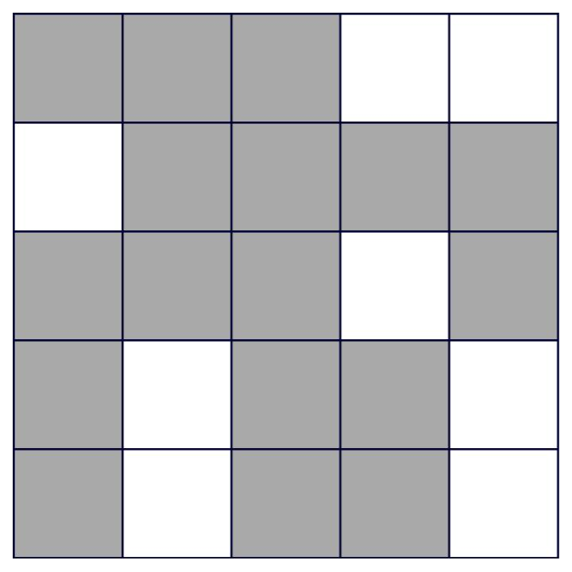

# **Lights Out Game**

## Description
This game was an exercise from the Udemy course, "The Modern React Bootcamp" by Colt Steele.  This exercise was for educational purposes and was used to practice React events, state, and props.  Using starter code, one could use this exercise to practice React events, state, and props or code along with the instructor.

## Screenshot
  